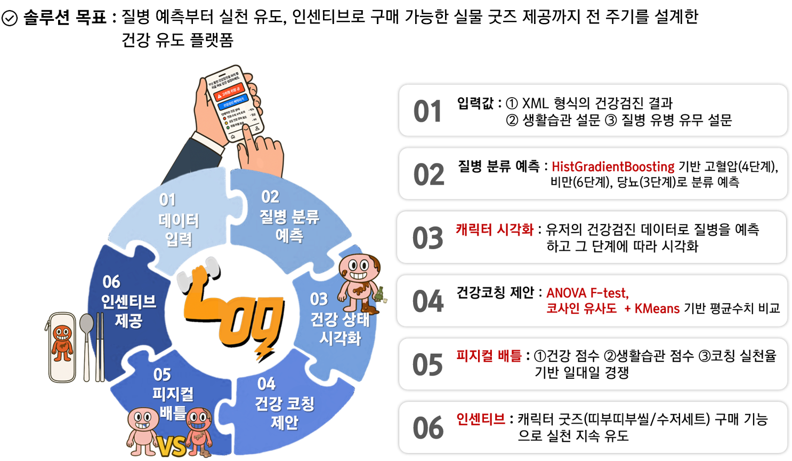
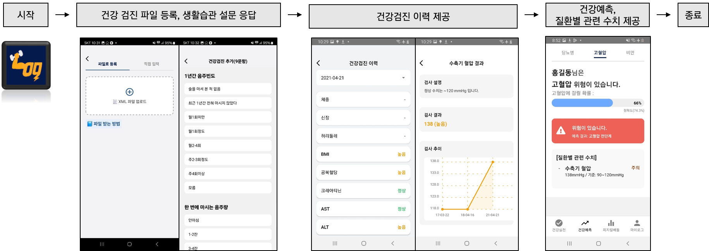
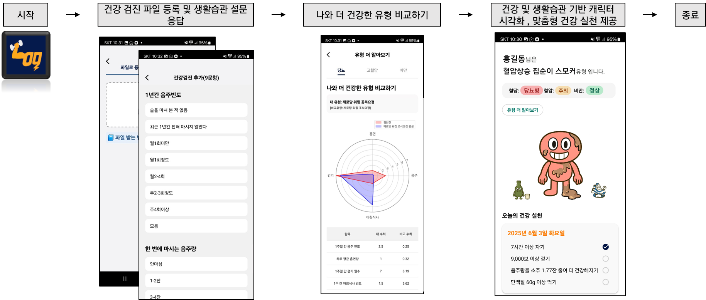
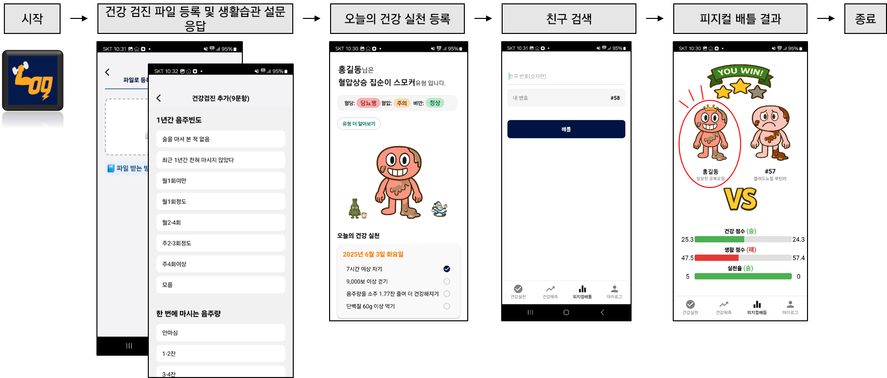

# 피지컬:로그 – 머신러닝 기반 점진 코칭 & 게이미피케이션 헬스케어 플랫폼  

  

**피지컬:로그(Physical:Log)** 는 건강에 관심은 있지만 행동 실천율이 낮은 사용자를 위해  
**유사군 비교 코칭**, **건강 점수화**, **게이미피케이션 보상**을 활용하여  
지속 가능한 건강 행동 변화를 유도하는 **디지털 헬스케어 솔루션**입니다.  
***

## 기술 스택

| 구분          | 사용 기술 |
|---------------|-----------|
| 언어          |  |
| 데이터 처리/분석 |   |
| 머신러닝/모델링 |     |
| 데이터베이스   |   |
| 시각화/리포트  |   |

***

## 데이터셋 설명

| 항목         | 내용 |
|--------------|------|
| 데이터 출처   | 질병관리청 **국민건강영양조사(KNHANES, 2017~2023)**|
| 샘플 수      | 약 5만 건 (건강검진·설문 응답 기반) |
| 주요 대상     | 만 30~50대 성인 (고혈압, 당뇨, 비만 등 생활습관성 질환 포함) |
| 활용 목적     | 질병 단계 분류, 건강 점수 산출, 생활습관 비교 분석, 맞춤형 코칭 추천 |

---

## 주요 Feature 목록

| Feature | 설명 |
|------|---------|
| HE_sbp1, HE_dbp1 | 1차 수축기/이완기 혈압 |
| HE_LDL_drct | LDL 콜레스테롤 |
| HE_HDL_st2 | HDL 콜레스테롤 |
| AGE | 나이 |
| HE_wc | 허리둘레 |
| HE_HbA1c | 당화혈색소 |
| HE_glu | 공복혈당 |
| HE_wt, HE_ht | 체중, 신장 |
| HE_BMI | 체질량지수 |
| HE_wc | 허리둘레 |
| HE_HP | 고혈압 유병 여부 |
| HE_DM_HbA1c | 당뇨병 유병 여부 |
| HE_obe | 비만 여부 |
|DI1_pr| 고혈압 의사 진단 여부|
|DE1_dg| 당뇨병 의사 진단 여부|
|DI1_2| 혈압조절제 복용|
|DE1_3| 당뇨병 혈당관리 치료여부|
| BD1_11 | 1년간 음주빈도|
| BD2_1 | 한 번에 마시는 음주량|
| BS3_2 | 일반담배(궐련) 흡연량|
| BS12_47_1 | 전자담배 흡연자 하루평균 흡연량|
| BE3_31 | 1주일 간 걷기 일수|
| BE3_33 | 걷기 시간(분)|
| L_BR_FQ | 1주일간 아침식사 빈도|
***

## 시스템 아키텍처

***

## 주요 기능

### 1. 건강 정보 등록 및 이력 확인
>- 사용자가 건강검진 데이터와 생활습관 설문을 입력하면 **MariaDB**에 저장되어 개인별 건강검진 이력을 관리  
>- 저장된 데이터를 기반으로 **머신러닝 모델 기반 HistGradientBoostingClassifier**을 적용해 건강 상태를 예측하고, 질환별 주요 수치를 제공

| **건강 정보 등록/이력 확인** |
|-----------------------------|
|  |

---

### 2. 나와 더 건강한 유형 비교하기
>- 건강관리 유형을 **ANOVA F-test**로 주요 특징을 선별하고, **코사인 유사도 + KMeans 군집화**를 통해 유형을 분류 
>- 각 군집을 캐릭터로 시각화하여 사용자에게 보여주고, 유형별 맞춤 건강 실천 방안을 제안

| **유사군 비교 화면** |
|---------------------|
|  |
---
### 3. 유저간 건강 점수 배틀
>- **질병 예측 기반 점수화**: **머신러닝(HistGradientBoosting)**으로 3대 질환 정상 확률을 점수화
>- **생활습관 점수화**: CARDIA·FTND·IPAQ 기준표 기반 + 랜덤포레스트 피처 중요도로 가중치 반영
>- **실천율 점수화**: **KMeans 군집화 + 코사인 유사도 + ANOVA F-test**로 도출된 맞춤형 피드백을 기준으로, 사용자의 실천 여부(실천=100점, 미실천=0점)를 평가하여 점수화
>- 세 점수를 종합해 최종 건강 점수를 계산하고, **유저 간 배틀 모드**로 경쟁 요소 제공

| **유저간 피지컬 배틀 화면** |
|---------------------|
|  |
***

## 핵심 기여
- 국민건강영양조사(KNHANES) 데이터를 기반으로 **전처리 및 EDA 수행**
- **머신러닝(HistGradientBoostingClassifier)을** 활용한 질환 예측 모델 설계 및 **KMeans 기반** 건강 유형 군집화
- 데이터 불균형 보정과 Feature Selection으로 **모델 성능 개선 (AUC 0.91 달성)**
- 질병 예측·생활습관·실천율을 통합한 **건강 점수화 알고리즘 설계 및 구현**
***

## 폴더 구조 (주요)
<pre>
📂 Total_model/
 ┣ 📜 cluster_service.ipynb      # 건강 유형 군집화 및 유사군 탐색
 ┣ 📜 disease_prediction.ipynb   # HistGB 기반 질병 예측 및 위험도 분류
 ┣ 📜 life_score_battle.ipynb    # 생활습관 점수 산출 및 유저 간 배틀 기능
 ┣ 📜 goal.ipynb                 # 개인별 실천 항목 관리 및 목표 설정
 ┗ 📜 Icon.ipynb                 # 유형별 캐릭터/아이콘 시각화
</pre>
***
